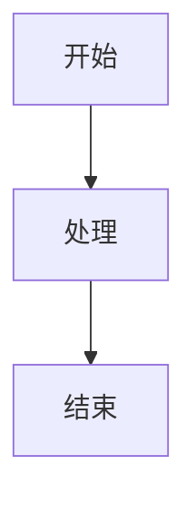
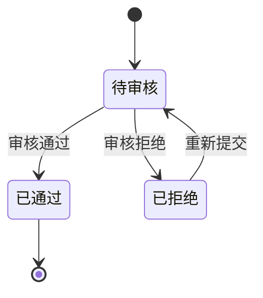

# Mermaid.js 图表渲染集成指南

## 概述

本指南详细说明如何在 HTML PRD 中集成和使用 Mermaid.js 进行业务流程图、状态转换图等图表的渲染。

***

## 1. 集成方式选择

### 方案一：本地 Bundle（**默认，离线交付必用**）

HTML PRD 默认使用相对路径，确保 `file://` 与打包 zip 均可打开。

**步骤**：

1. 从 [Mermaid 官方发布页](https://github.com/mermaid-js/mermaid/releases) 下载 `mermaid.min.js`（约 3MB）
2. 保存到 `src/docs/assets/scripts/mermaid.min.js`
3. 在 HTML 底部引入（与 `html-template.html` 一致）：

```html
<script src="./assets/scripts/mermaid.min.js" defer></script>
```

**优点**：

- 完全离线可用（CDN 在 `file://` 下常挂起）
- 版本可控
- Playwright 截图稳定

**缺点**：

- 需手动更新版本
- 增加交付体积

> 初始化目录：`node skills/pm-prd-html-writer/scripts/init-assets.mjs src/docs` 会创建 `assets/scripts/`。

### 方案二：CDN 引入（仅在线预览）

仅当 PRD **始终通过 HTTP 服务访问**且不需要离线交付时可用。

```html
<script src="https://cdn.jsdelivr.net/npm/mermaid@10/dist/mermaid.min.js"></script>
```

**缺点**：离线双击 HTML 无法加载；交付前须改回本地 bundle。

***

## 2. 初始化配置

模板使用 **`startOnLoad: false` + `mermaid.run()`**，并预处理 `<pre class="mermaid"><code>` 结构（见 `html-template.html`）。

```javascript
function prepareMermaidSources() {
  document.querySelectorAll('.mermaid').forEach((el) => {
    const codeEl = el.querySelector('code');
    const source = (codeEl ? codeEl.textContent : el.textContent).trim();
    el.dataset.originalCode = source;
    if (codeEl) codeEl.remove();
    if (el.tagName === 'PRE') {
      const div = document.createElement('div');
      div.className = 'mermaid';
      div.dataset.originalCode = source;
      div.textContent = source;
      el.replaceWith(div);
    } else {
      el.textContent = source;
    }
  });
}

async function initMermaid() {
  prepareMermaidSources();
  const nodes = document.querySelectorAll('.mermaid');
  if (nodes.length === 0) return;

  mermaid.initialize({
    startOnLoad: false,
    theme: 'base',
    themeVariables: { /* 见 html-template */ },
    flowchart: { htmlLabels: true, curve: 'basis', useMaxWidth: true },
    securityLevel: 'loose'
  });

  await mermaid.run({ nodes });
}
```

**配置说明**：

| 参数              | 值          | 说明                        |
| --------------- | ---------- | ------------------------- |
| `startOnLoad`   | `false`    | 由 `initMermaid()` 手动 `run` |
| `theme`         | `'base'`  | 允许完全自定义颜色          |
| `securityLevel` | `'loose'` | 富文本标签正常工作    |
| `curve`         | `'basis'` | 贝塞尔曲线           |
| `useMaxWidth`   | `true`    | 图表自适应容器宽度                 |

***

## 3. PRD 流程图样式规范

为确保与现有 `pm-prd-writer` 的 Mermaid 配置完全一致，每个流程图必须包含以下三个部分：

### 3.1 必须包含的组件

#### init 配置块

```mermaid
%%{init: {
  'theme': 'base',
  'themeVariables': {
    'fontSize': '14px',
    'primaryColor': '#DBEAFE',
    'primaryTextColor': '#1E3A8A',
    'primaryBorderColor': '#2563EB',
    'lineColor': '#64748B',
    'secondaryColor': '#FFEDD5',
    'tertiaryColor': '#FEE2E2'
  }
}}%%
```

#### classDef 定义

```mermaid
classDef main fill:#DBEAFE,stroke:#2563EB,stroke-width:2px,color:#1E3A8A
classDef normal fill:#F1F5F9,stroke:#64748B,stroke-width:1px,color:#334155
classDef timeout fill:#FFEDD5,stroke:#EA580C,stroke-width:2px,color:#9A3412
classDef error fill:#FEE2E2,stroke:#DC2626,stroke-width:2px,color:#991B1B
classDef external fill:#E0E7FF,stroke:#4F46E5,stroke-width:2px,color:#3730A3
classDef storage fill:#DCFCE7,stroke:#16A34A,stroke-width:2px,color:#166534
```

#### linkStyle 样式

```mermaid
linkStyle default stroke:#64748B,stroke-width:1.5px
```

### 3.2 完整示例

```html
<div class="mermaid">
%%{init: {
  'theme': 'base',
  'themeVariables': {
    'fontSize': '14px',
    'primaryColor': '#DBEAFE',
    'primaryTextColor': '#1E3A8A',
    'primaryBorderColor': '#2563EB',
    'lineColor': '#64748B',
    'secondaryColor': '#FFEDD5',
    'tertiaryColor': '#FEE2E2'
  }
}}%%
flowchart TD
    A[用户登录]:::main --> B[验证身份]:::normal
    B --> C{验证结果?}:::main
    C -->|成功| D[进入系统]:::main
    C -->|失败| E[显示错误]:::error
    C -->|超时| F[重试提示]:::timeout
    
    G[(用户数据库)]:::storage -.-> B
    
    classDef main fill:#DBEAFE,stroke:#2563EB,stroke-width:2px,color:#1E3A8A
    classDef normal fill:#F1F5F9,stroke:#64748B,stroke-width:1px,color:#334155
    classDef timeout fill:#FFEDD5,stroke:#EA580C,stroke-width:2px,color:#9A3412
    classDef error fill:#FEE2E2,stroke:#DC2626,stroke-width:2px,color:#991B1B
    classDef external fill:#E0E7FF,stroke:#4F46E5,stroke-width:2px,color:#3730A3
    classDef storage fill:#DCFCE7,stroke:#16A34A,stroke-width:2px,color:#166534
    
    linkStyle default stroke:#64748B,stroke-width:1.5px
</div>
```

### 3.3 颜色方案速查表

| 类型           | 用途       | 背景色     | 边框色     | 文字色     |
| ------------ | -------- | ------- | ------- | ------- |
| **main**     | 主要流程节点   | #DBEAFE | #2563EB | #1E3A8A |
| **normal**   | 普通处理步骤   | #F1F5F9 | #64748B | #334155 |
| **timeout**  | 超时/等待节点  | #FFEDD5 | #EA580C | #9A3412 |
| **error**    | 错误/异常节点  | #FEE2E2 | #DC2626 | #991B1B |
| **external** | 外部系统/实体  | #E0E7FF | #4F46E5 | #3730A3 |
| **storage**  | 数据存储/数据库 | #DCFCE7 | #16A34A | #166534 |

***

## 4. 支持的图表类型

### ✅ 推荐使用的类型

#### 4.1 流程图 (flowchart)

PRD 中最常用的图表类型，用于描述业务流程。

**TD 方向（自上而下）**：



**LR 方向（从左到右）**：


**适用场景**：

- 用户操作流程
- 业务逻辑流转
- 系统交互顺序
- 决策分支逻辑

#### 4.2 状态转换图 (stateDiagram-v2)

用于描述对象的状态变化和转换条件。



**适用场景**：

- 订单状态管理
- 审批流程
- 任务生命周期
- 对象状态机

### ❌ 不推荐的类型（除非明确要求）

以下类型默认不使用，仅在用户明确提出需求时才考虑：

- **sequenceDiagram** - 时序图（语法复杂，渲染效果不稳定）
- **classDiagram** - 类图（更适合技术设计文档）
- **erDiagram** - ER 图（适合数据库设计）
- **gantt** - 甘特图（适合项目管理）
- **pie** - 饼图（建议使用专业图表库）

***

## 5. 渲染失败降级策略

为提升用户体验，必须实现错误捕获和降级显示机制。

### 5.1 错误事件监听

```javascript
window.addEventListener('mermaid_error', function(evt) {
  const container = evt.target;
  container.innerHTML = `
    <div class="mermaid-error" style="
      padding: 16px;
      background-color: #FEF2F2;
      border: 1px solid #FECACA;
      border-radius: 8px;
      margin: 16px 0;
    ">
      <p style="
        color: #991B1B;
        font-size: 14px;
        margin: 0 0 12px 0;
        display: flex;
        align-items: center;
        gap: 8px;
      ">
        ⚠️ 图表渲染失败
      </p>
      <details style="margin-bottom: 12px;">
        <summary style="
          cursor: pointer;
          color: #DC2626;
          font-size: 13px;
        ">查看源代码</summary>
        <pre style="
          margin-top: 8px;
          padding: 12px;
          background-color: #F3F4F6;
          border-radius: 4px;
          overflow-x: auto;
          font-size: 12px;
          line-height: 1.5;
        ">${container.dataset.originalCode || '无法获取源代码'}</pre>
      </details>
      <button onclick="retryMermaid(this)" style="
        padding: 6px 16px;
        background-color: #DC2626;
        color: white;
        border: none;
        border-radius: 4px;
        cursor: pointer;
        font-size: 13px;
      ">重试</button>
    </div>
  `;
});
```

### 5.2 重试机制实现

```javascript
function retryMermaid(button) {
  const errorDiv = button.closest('.mermaid-error');
  const mermaidContainer = errorDiv.parentElement;
  
  // 恢复原始内容
  if (mermaidContainer.dataset.originalCode) {
    mermaidContainer.innerHTML = mermaidContainer.dataset.originalCode;
    
    // 重新初始化
    if (typeof mermaid !== 'undefined') {
      mermaid.init(undefined, mermaidContainer);
    }
  }
}
```

### 5.3 预处理：保存原始代码

在渲染前保存原始代码，以便出错时恢复：

```javascript
document.addEventListener('DOMContentLoaded', function() {
  document.querySelectorAll('.mermaid').forEach(function(container) {
    // 保存原始代码用于错误恢复
    container.dataset.originalCode = container.textContent;
  });
});
```

***

## 6. 性能优化建议

### 6.1 懒加载策略

仅当图表进入可视区域时才进行渲染，减少首屏加载时间：

```javascript
// 使用 Intersection Observer 实现懒加载
const observer = new IntersectionObserver((entries) => {
  entries.forEach(entry => {
    if (entry.isIntersecting) {
      const container = entry.target;
      if (!container.dataset.rendered) {
        mermaid.init(undefined, container);
        container.dataset.rendered = 'true';
        observer.unobserve(container); // 渲染后停止观察
      }
    }
  });
}, {
  rootMargin: '100px' // 提前 100px 开始加载
});

// 观察所有未渲染的 mermaid 元素
document.querySelectorAll('.mermaid').forEach(el => observer.observe(el));
```

**注意**：使用懒加载时，需将 `mermaid.initialize` 中的 `startOnLoad` 设为 `false`。

### 6.2 渲染缓存

避免重复渲染已完成的图表：

```javascript
const renderCache = new Map();

async function renderMermaidWithCache(container) {
  const code = container.textContent.trim();
  
  // 检查缓存
  if (renderCache.has(code)) {
    container.innerHTML = renderCache.get(code);
    return;
  }
  
  // 执行渲染
  try {
    const svg = await mermaid.render(`mermaid-${Date.now()}`, code);
    renderCache.set(code, svg.svg); // 缓存 SVG 结果
    container.innerHTML = svg.svg;
  } catch (error) {
    console.error('Mermaid render error:', error);
    handleRenderError(container, error);
  }
}
```

### 6.3 大图拆分提示

当流程图节点数量超过 12 个时，应提示拆分：

```javascript
function validateDiagramSize(code) {
  // 统计节点数量（简单估算）
  const nodeMatches = code.match(/\w+\s*[\[\(]/g) || [];
  const nodeCount = nodeMatches.length;
  
  if (nodeCount > 12) {
    console.warn(
      `⚠️ 图表包含 ${nodeCount} 个节点，建议拆分为多个子流程以提高可读性。`
    );
    
    // 可选：在 UI 上显示警告
    return {
      valid: true,
      warning: `当前图表较复杂（${nodeCount} 个节点），建议考虑拆分`
    };
  }
  
  return { valid: true };
}
```

***

## 7. 截图兼容性

在使用 Playwright 等工具进行自动化截图时，必须确保 Mermaid 图表已完全渲染。

### 7.1 等待策略

```javascript
// Playwright 截图前的等待逻辑
async function captureWithMermaid(page, outputPath) {
  await page.goto('file:///path/to/prd.html', { waitUntil: 'networkidle' });
  
  // 等待 Mermaid 脚本加载
  await page.waitForFunction(() => typeof window.mermaid !== 'undefined', {
    timeout: 10000
  });
  
  // 等待所有 .mermaid 容器中的 SVG 渲染完成
  await page.waitForSelector('.mermaid svg', {
    timeout: 5000  // 至少等待 5 秒
  });
  
  // 额外等待确保动画完成
  await page.waitForTimeout(1000);
  
  // 执行截图
  await page.screenshot({
    path: outputPath,
    fullPage: true,
    type: 'png'
  });
}
```

### 7.2 超时配置建议

| 场景             | 推荐超时时间  | 说明       |
| -------------- | ------- | -------- |
| 单个简单图表（< 5 节点） | 2-3 秒   | 快速渲染     |
| 复杂流程图（5-15 节点） | 3-5 秒   | 正常范围     |
| 大型图表（> 15 节点）  | 5-10 秒  | 可能需要更长时间 |
| 多图表页面          | 10-15 秒 | 总等待时间    |

### 7.3 渲染状态检测

```javascript
// 检测 Mermaid 是否全部渲染完成
async function isMermaidFullyRendered(page) {
  return await page.evaluate(() => {
    const mermaidContainers = document.querySelectorAll('.mermaid');
    let allRendered = true;
    
    mermaidContainers.forEach(container => {
      const hasSvg = container.querySelector('svg') !== null;
      const hasError = container.querySelector('.mermaid-error') !== null;
      
      if (!hasSvg && !hasError) {
        allRendered = false;
      }
    });
    
    return allRendered;
  });
}
```

### 7.4 截图失败的常见原因及解决方案

| 问题     | 原因               | 解决方案                       |
| ------ | ---------------- | -------------------------- |
| 图表区域空白 | Mermaid 未加载或正在渲染 | 增加 `waitForSelector` 超时时间  |
| 图表被截断  | CSS 动画未完成        | 添加 `waitForTimeout` 等待动画结束 |
| 样式丢失   | 外部 CSS 未加载       | 确保 `networkidle` 状态        |
| 只显示源码  | JavaScript 报错    | 检查浏览器控制台错误信息               |

***

## 8. 最佳实践总结

### ✅ 推荐做法

1. **统一配置**：始终使用第 3 节定义的标准样式规范
2. **错误处理**：实现完整的降级和重试机制
3. **性能优化**：对多图表页面启用懒加载
4. **可访问性**：为图表添加适当的 `aria-label` 或标题
5. **响应式设计**：确保图表在不同屏幕尺寸下正常显示
6. **版本锁定**：生产环境使用固定版本的 Mermaid.js

### ❌ 应避免的做法

1. **忽略错误处理**：导致用户看到混乱的源代码
2. **过度复杂**：单个图表超过 15 个节点
3. **混合主题**：同一文档中使用不同的颜色方案
4. **依赖外网**：离线交付场景使用 CDN
5. **省略配置**：使用默认主题导致样式不一致

***

## 附录：快速参考卡片

### 标准模板（复制即用）

```html
<!-- 1. 引入 Mermaid（离线默认路径） -->
<script src="./assets/scripts/mermaid.min.js" defer></script>

<!-- 2. 图表容器（支持 pre.mermaid > code） -->
<pre class="mermaid"><code>flowchart TD
    A[开始]:::main --> B[处理]:::normal
    classDef main fill:#DBEAFE,stroke:#2563EB,...
    linkStyle default stroke:#64748B,stroke-width:1.5px
</code></pre>

<!-- 3. 初始化逻辑见 html-template.html 内 initMermaid() -->
```

***

**文档版本**: v1.1\
**最后更新**: 2026-06-10\
**适用范围**: pm-prd-html-writer skill 生成的所有 HTML PRD 文档
